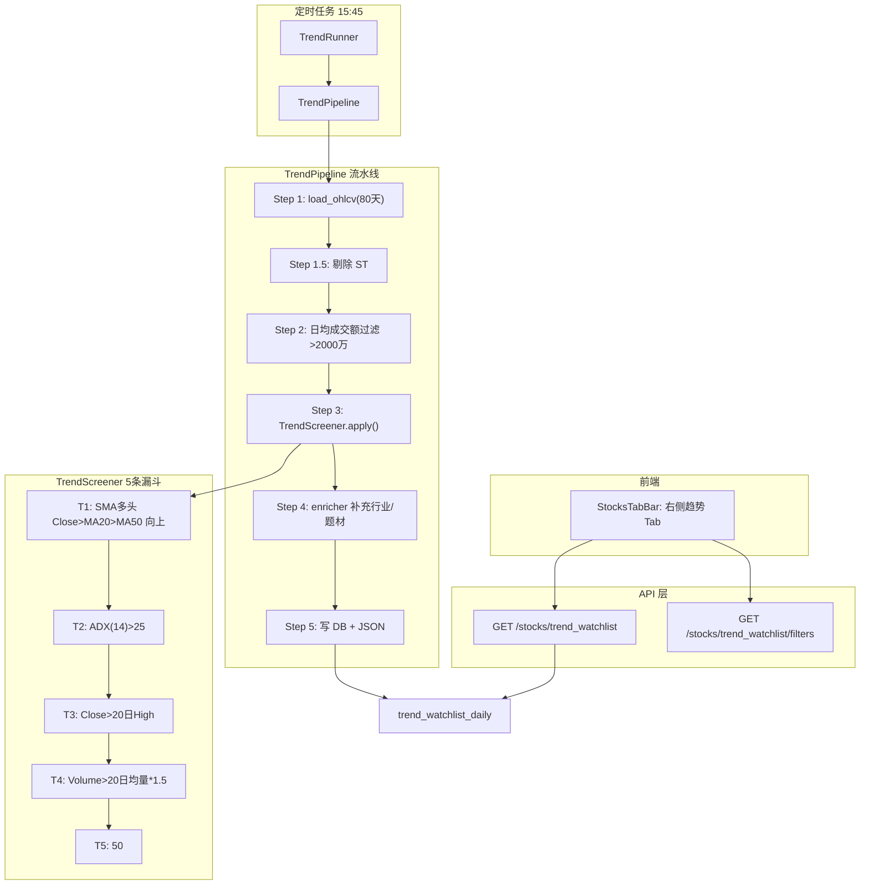

## 用户需求

在 AlphaReader 的 Stocks 页面中，与现有"VCP 策略"和"价投"并列，新增一个"右侧趋势"Tab，实现基于 `doc/youce.md` 双均线趋势突破策略的每日自动选股系统。

## 产品概述

基于右侧趋势交易哲学（不预测只跟随、截断亏损让利润奔跑），从全市场 A 股中每日筛选出满足趋势突破条件的股票白名单。该策略与 VCP 策略互补：VCP 聚焦波动收缩形态（等待爆发），右侧趋势聚焦已确认的趋势突破信号（确认后跟随）。

## 核心功能

1. **右侧趋势 Screener Pipeline**：每交易日收盘后自动运行，从全市场 5000+ 只 A 股中通过 5 条技术面条件串行漏斗筛选，输出趋势突破白名单

- 基础筛选：排除 ST + 日均成交额 > 2000 万
- 条件 1：MA 多头排列（Close > SMA20 > SMA50，且均线向上）
- 条件 2：ADX 趋势强度（ADX(14) > 25）
- 条件 3：20 日高点突破（Close > 过去 20 日最高价）
- 条件 4：放量确认（Volume > 20 日均量 x 1.5）
- 条件 5：RSI 动量区间（50 < RSI(14) < 80）

2. **独立数据库存储**：新建 `trend_watchlist_daily` 表，存储 trend_score/adx/rsi/ma20/ma50 等指标
3. **后端 API**：提供趋势白名单查询接口（支持行业/概念筛选），复用 VCP 的筛选器模式
4. **前端展示**：在 StocksTabBar 新增"右侧趋势"Tab，以卡片列表形式展示筛选结果，包含 trend_score、ADX、RSI 等核心指标
5. **定时任务**：每交易日 15:45 自动运行（在 VCP Screener 15:40 之后）
6. **文档更新**：迭代 `doc/screener_logic.md`，补充右侧趋势策略完整逻辑文档

## 技术栈

- **后端**：Python FastAPI + SQLAlchemy 2.0 (asyncpg) + pandas（复用现有技术栈）
- **前端**：uni-app Vue 3 组合式 API（复用现有技术栈）
- **数据库**：PostgreSQL 16 + Alembic 迁移
- **调度**：APScheduler CronTrigger（复用现有 scheduler.py 模式）

## 实现方案

采用与现有 VCP Screener 完全平行的架构模式，新建独立的 Trend Screener 模块。核心策略：复用现有数据加载层（DataLoader）和 ST 剔除逻辑，新建独立的过滤器（TrendScreener）和管道（TrendPipeline），写入独立的 `trend_watchlist_daily` 表，通过独立的 API 端点供前端查询。

关键技术决策：

1. **SMA 而非 EMA**：右侧趋势策略使用 SMA20/SMA50（与 youce.md 保持一致），而非 VCP 的 EMA。SMA 直接从 OHLCV 数据 rolling 计算，无需 Parquet 快照。
2. **ADX 计算**：使用 pandas 向量化实现 Wilder's ADX(14)，先计算 +DI/-DI，再平滑得到 ADX。需要约 28 天 OHLCV 数据，现有 DB 636 天数据完全满足。
3. **RSI 计算**：使用 Wilder's RSI(14)，基于 close 的逐日涨跌幅 exponential moving average。
4. **趋势得分（trend_score）**：设计为三指标归一化加权综合分 = 0.4 * ADX_norm + 0.3 * RSI_norm + 0.3 * VolRatio_norm，其中 ADX_norm = min(ADX/50, 1.0)，RSI_norm = (RSI-50)/30 clamp to [0,1]，VolRatio_norm = min(vol_ratio/3.0, 1.0)。
5. **日均成交额筛选**：从 OHLCV 的 `amount` 字段（单位：元）计算近 20 日日均成交额，门槛 2000 万元。
6. **内存优化**：服务器仅 4GB 内存，Pipeline 复用 DataLoader 已加载的 OHLCV（不重复加载），所有指标计算使用 pandas groupby + rolling 向量化，避免逐股 Python 循环。

## 实现要点

- **复用 DataLoader**：右侧趋势 Pipeline 复用 `data_loader.py` 的 `load_ohlcv()` 和 `_load_st_codes()` 方法，避免重复数据加载。OHLCV lookback 改为 80 天（SMA50 需要至少 50 天 + ADX 28 天缓冲）。
- **向量化指标计算**：ADX/RSI/SMA 全部使用 pandas groupby('ts_code') + rolling/ewm 向量化，一次性计算全市场 5000+ 只股票，避免 for 循环。
- **DB 写入模式**：完全复制 VCP Pipeline 的 `_save_to_db` 模式（同一天重跑先 DELETE 再 INSERT，事务原子性）。
- **API 模式**：复制 VCP watchlist 的端点结构（get 最新日期 + 行业/概念筛选 + order by trend_score desc），复用 `_generate_futu_url` 工具函数。
- **定时任务**：在 `scheduler.py` 中新增 `_trend_screener_job`，15:45 触发（比 VCP 的 15:40 晚 5 分钟）。
- **Alembic 迁移**：新增 migration 创建 `trend_watchlist_daily` 和 `trend_screener_runs` 表。
- **前端模式**：完全复用 VCP Tab 的卡片列表结构和筛选器模式，替换指标展示字段（vcp_score → trend_score, ema120 → adx/rsi）。

## 架构设计



## 目录结构

```
backend/
├── app/
│   ├── models/
│   │   └── screener.py              # [MODIFY] 新增 TrendScreenerRun + TrendWatchlistDaily ORM 模型
│   ├── api/v1/
│   │   └── stocks.py                # [MODIFY] 新增 /trend_watchlist 和 /trend_watchlist/filters 端点
│   ├── services/
│   │   ├── scheduler.py             # [MODIFY] 新增 _trend_screener_job 定时任务（15:45）
│   │   └── screener/
│   │       ├── trend_filters.py     # [NEW] 右侧趋势过滤器：TrendFilterConfig + TrendScreener（含 ADX/RSI/SMA 向量化计算）
│   │       ├── trend_pipeline.py    # [NEW] 右侧趋势 Pipeline：编排数据加载→成交额过滤→技术面过滤→enricher→DB 写入
│   │       ├── trend_runner.py      # [NEW] CLI 入口脚本：解析参数→构造 config→执行 pipeline
│   │       ├── data_loader.py       # [不修改] 复用现有 DataLoader.load_ohlcv() 和 ST 剔除
│   │       ├── enricher.py          # [不修改] 复用现有 enrich_watchlist()
│   │       └── filters.py           # [不修改] 现有 VCP 过滤器不改动
│   └── ...
├── alembic/versions/
│   └── xxxx_add_trend_watchlist.py  # [NEW] Alembic 迁移：创建 trend_watchlist_daily + trend_screener_runs 表
frontend/
├── src/
│   ├── components/stocks/
│   │   └── StocksTabBar.vue         # [MODIFY] 新增"右侧趋势"Tab
│   ├── pages/stocks/
│   │   └── index.vue                # [MODIFY] 新增 trend Tab 内容区（数据加载/卡片渲染/筛选器）
│   └── utils/
│       └── api.js                   # [MODIFY] 新增 fetchTrendWatchlist() 和 fetchTrendFilters()
doc/
└── screener_logic.md                # [MODIFY] 新增右侧趋势策略完整逻辑文档章节
```

## 关键数据结构

```python
# trend_filters.py — 核心配置
@dataclass
class TrendFilterConfig:
    # 基础筛选
    min_avg_amount: float = 2e7       # 日均成交额下限（2000万元）
    amount_window: int = 20           # 成交额计算窗口（交易日）
    # 条件 T1: MA 多头排列
    ma_short: int = 20                # 短期均线周期
    ma_long: int = 50                 # 长期均线周期
    ma_slope_window: int = 5          # 均线方向判断窗口
    # 条件 T2: ADX 趋势强度
    adx_period: int = 14
    adx_threshold: float = 25.0
    # 条件 T3: 突破确认
    breakout_window: int = 20         # 突破回溯窗口
    # 条件 T4: 放量确认
    volume_ratio: float = 1.5
    volume_ma_window: int = 20
    # 条件 T5: RSI 动量
    rsi_period: int = 14
    rsi_lower: float = 50.0
    rsi_upper: float = 80.0


# screener.py — 新增 DB 模型
class TrendWatchlistDaily(Base):
    __tablename__ = "trend_watchlist_daily"
    id: Mapped[int]
    run_date: Mapped[date]
    ts_code: Mapped[str]
    name: Mapped[str | None]
    current_price: Mapped[float | None]
    ma20: Mapped[float | None]
    ma50: Mapped[float | None]
    adx: Mapped[float | None]
    rsi: Mapped[float | None]
    volume_ratio: Mapped[float | None]     # 当日量/20日均量
    trend_score: Mapped[float | None]
    industry: Mapped[str | None]
    concepts: Mapped[str | None]
    main_business: Mapped[str | None]
    fund_flow_net: Mapped[float | None]
    run_id: Mapped[int | None]
    # UniqueConstraint("run_date", "ts_code")
```

## Agent Extensions

### SubAgent

- **code-explorer**
- 用途：在实现各步骤时探索相关文件的完整内容（如 VCP 卡片组件模板、scheduler.py 完整注册逻辑等），确保新代码与现有模式完全一致
- 预期结果：获取准确的代码上下文，避免风格不一致或遗漏依赖