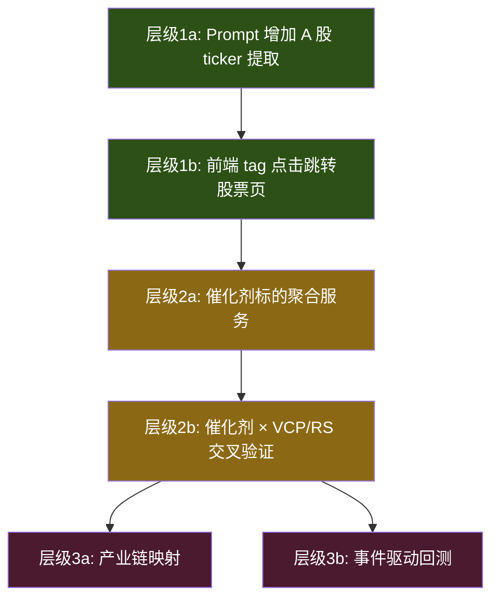

这是个很有意思的问题！让我先深入了解一下当前项目的新闻数据结构、已有的分析能力和整体架构，这样才能给出有针对性的建议。
现在我对整个项目有了全面的了解。让我来和你深入探讨这个问题。

---

## 从新闻概览中发现更多投资标的——基于 AlphaReader 的分析

### 当前你已有的"发现标的"能力

先盘点一下现有链路：

| 模块 | 能力 | 缺口 |
|------|------|------|
| **AI 评分** | 按投资参考价值打分 0-10，tags 里提取公司名、`relevant_tickers` 提取股票代码 | ❶ ticker 提取了但**没充分利用**——tags 里的公司名和 ticker 没有与 A 股代码映射 |
| **Context Bridge** | 把 Top 66 条新闻喂给 Gemini 做策略分析 | ❷ 是一次性人工触发（三击彩蛋），**没有自动化**产出「可行动标的列表」 |
| **VCP Screener** | 纯技术面选股，每日 30-50 只白名单 | ❸ 与新闻完全**割裂**——技术面选出的票和新闻催化剂之间没有交叉验证 |
| **Daily Briefing** | 整合 7 大数据源的 AI 日报 | ❹ 输出是叙事性文本，没有结构化的**"今日新闻催化标的"**清单 |
| **新闻卡片 UI** | 展示 tags、sentiment、gravity | ❺ 看到公司名但**没有直接跳转到该标的**的能力（K 线、RS、VCP 交叉验证） |

### 我的建议方案（由浅到深，3 个层级）

---

### 层级 1：低成本快赢——「新闻 → 标的」的结构化打通（改 Prompt + 前端联动）

**核心思想**：你的 AI 评分环节已经在提取 `relevant_tickers` 和公司名 tags，但这些数据在前端是"死数据"。只需做两件事就能大幅提升发现标的的效率：

#### 1a. 增强 AI Prompt 的 ticker 提取

当前中文新闻 Prompt 只要求提取 tags（`"宁德时代"`这种文本标签），**没有要求输出 A 股代码**。英文新闻虽然提取了 `relevant_tickers`（`NVDA`），但都是美股代码。

**改进**：在中文评分 Prompt 里增加一个 `a_share_tickers` 字段，要求 LLM 直接输出涉及的 A 股代码（如 `300750.SZ`）。这样每条新闻都能关联到具体 A 股标的。

成本：几乎为零（Prompt 多几行字，SiliconFlow 免费模型）。

#### 1b. 前端 Tag 点击直达股票页

现在 NewsCard 的 tag 点击是触发 `tag-search`（搜索同标签新闻）。可以加一个逻辑：如果 tag 匹配到股票代码或公司名，直接跳转到股票详情页（RS Rating + VCP 状态 + 历史推演），实现「看新闻 → 一键看这只票的技术面」。

---

### 层级 2：中等工作量——自动化「新闻催化剂 × 技术面」交叉验证

**核心思想**：最好的投资标的 = **基本面催化剂（新闻驱动）+ 技术面确认（VCP/趋势）**。你现在两套系统各跑各的，交叉验证完全靠人脑。

#### 2a. 每日 Pipeline 增加「催化剂标的」聚合

在 Daily Briefing 生成之前，增加一个自动化步骤：

```
每日新闻 → 提取所有 ai_score ≥ 4 的新闻中的 A 股 tickers
          → 按 ticker 聚合（同一只票当天被多少条高分新闻提及）
          → 标记「催化剂热度」
```

这就产生了一张「**今日新闻催化标的排行榜**」。

#### 2b. 与 VCP 白名单 / RS Rating 做交叉

```
催化剂排行榜 ∩ 当日 VCP 白名单 → 「技术面+催化剂双确认」标的
催化剂排行榜 ∩ RS ≥ 80          → 「强势股+催化剂」标的
催化剂排行榜 - VCP 白名单        → 「有催化但技术面未就绪，加入观察池」
```

**前端展示**：在 Stocks 页面增加一个 Tab「催化剂」或在 VCP Tab 里给有催化剂的标的加个 🔥 标记。

**技术实现**：
- 后端新增一个 `catalyst_aggregator.py` 服务，每日 Briefing 之前跑
- 写入一张新表 `news_catalyst_stocks`（date, ts_code, news_count, top_score, catalyst_summary）
- 前端 VCP 列表增加 `has_catalyst` 筛选

---

### 层级 3：更大愿景——AI 驱动的「事件驱动选股」

**核心思想**：不只是被动匹配，而是让 AI 主动从新闻中挖掘投资逻辑链。

#### 3a. 产业链映射

很多新闻表面上讲的是 A 公司，但真正受益的是 B 公司（上下游）。比如"台积电扩产"的受益方可能是"北方华创"。

可以在 AI Prompt 中增加：
```
- supply_chain_beneficiaries: 列出可能间接受益的A股公司及逻辑
```

这个成本也不高（仍然是 Prompt 改进），但需要 LLM 有足够的 A 股知识。DeepSeek/Qwen 对中国产业链的理解还是不错的。

#### 3b. 事件驱动回测

长期积累后，你有了「新闻催化 → 股价后续表现」的历史数据。可以做简单的统计：
- ai_score ≥ 8 且 VCP 白名单上的票，后续 5 日/20 日胜率如何？
- 特定 catalyst_type（如"业绩超预期"）的历史预测准确率如何？

这个可以作为长期数据积累的方向，不急于实现。

---

### 推荐的实施路径



**绿色（层级1）**：1-2 天可完成，几乎零成本，立刻改善体验  
**黄色（层级2）**：3-5 天，需要新增后端服务 + 前端 Tab，但产出价值最大  
**紫色（层级3）**：探索性的，可以在层级 2 跑稳之后慢慢做

---

### 我的核心观点

你的系统最大的未开发价值在于：**新闻情报和技术面选股之间的桥梁还没搭建**。目前这两个模块是各自独立运行的孤岛。一个 VCP 白名单上的票，如果当天恰好有 8 分以上的催化剂新闻加持，这只票的投资价值远高于没有催化剂的——但现在你只能靠自己在两个 Tab 之间来回切换人肉交叉验证。

层级 2 的「催化剂 × 技术面交叉验证」如果做出来，本质上就是一个简化版的「事件驱动 + 趋势跟踪」复合策略，这在机构里是非常主流的做法。

你觉得这个方向怎么样？哪个层级你最感兴趣，想先做哪个？